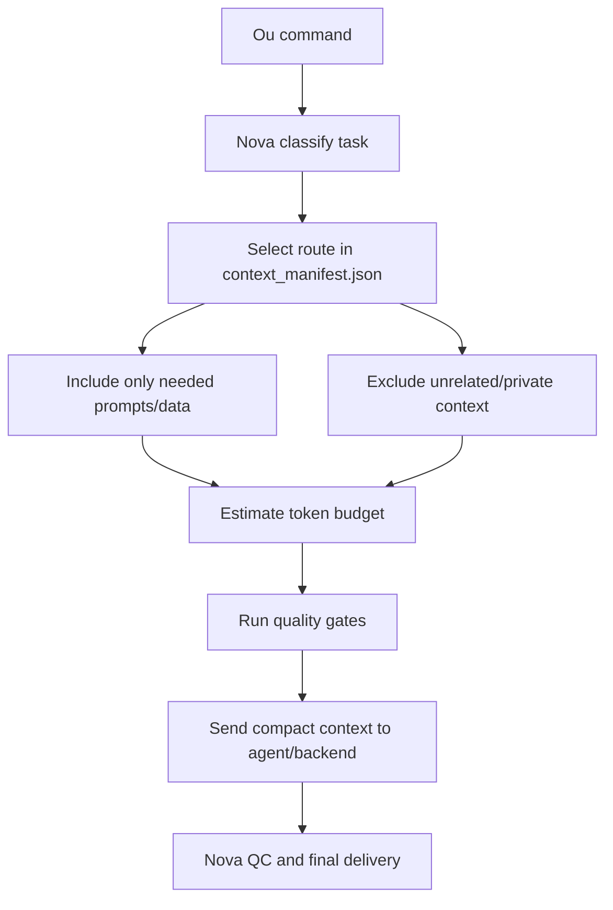

# Nova Context Reducer

Nova Context Reducer is the token-reduction layer for Ou AI Command Office.

Its job is to keep accuracy while reducing unnecessary context. Nova first classifies the task, then loads only the relevant prompts, mock/public-safe data, workflow rules, and output format for that task.

## Workflow

## Gates

- `accuracy_preserved`
- `no_missing_expected_context`
- `no_irrelevant_private_context`
- `token_reduction_above_50_pct`
- `source_list_visible`

## Route Rule

If the command is about sales, do not load portfolio or astrology context.

If the command is about portfolio, use allocation truth first and do not load customer CRM unless explicitly requested.

If the command includes real customer, portfolio, family, astrology, or confidential details, store/retrieve those in Google Drive/private context only. Do not commit them to GitHub or show them in public UI.

## MVP Behavior

For the current static/dashboard phase, the reducer does not read real Drive files automatically. It produces a visible context plan that tells Ou and Nova:

- task type
- selected agents
- included context files
- excluded context categories
- estimated tokens before/after
- estimated reduction percentage
- quality gate result
